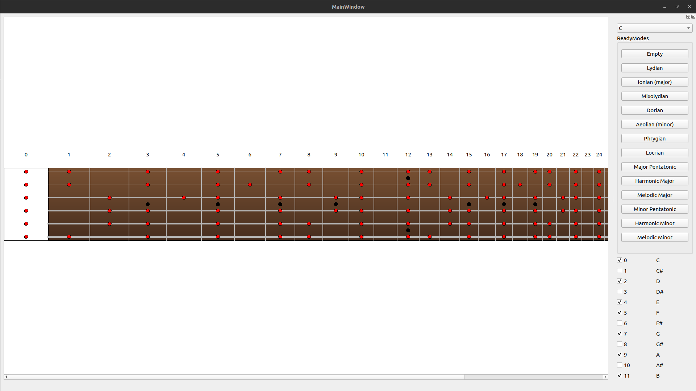

# MusicalModeFretboardVisualizer

###### Lydian

###### Ionian

###### Mixolydian

###### Dorian

###### Aeolian (minor)

###### Phrygian

###### Locrian

###### Major Pentatonic

###### Harmonic Major

###### Melodic Major

###### Minor Pentatonic

###### Harmonic Minor

###### Melodic Minor

